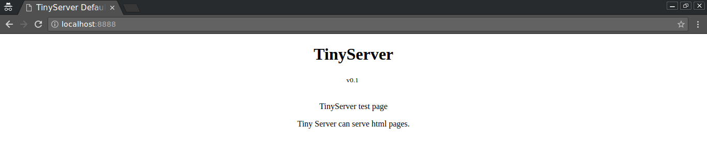

# TinyServer
### This is a tiny HTTP server written in Python

It provides minimal HTTP server to serve simple HTML pages . Easy and simple .

## Screenshots
Using tinyserver is just as easy as it looks.




Default 404 Page.


## Usage
It serves HTML pages.
At least one `.hmtl` file should be in the current directory.

If no specified filename is given in URL then it will serve `index.html`.

Start the server in specified port.
```python
python tiny.py 8888
```
Start the server in default port 5000
```python
python tiny.py
```

### I made this to learn about HTTP Servers.
#### Not intended for actual use.
